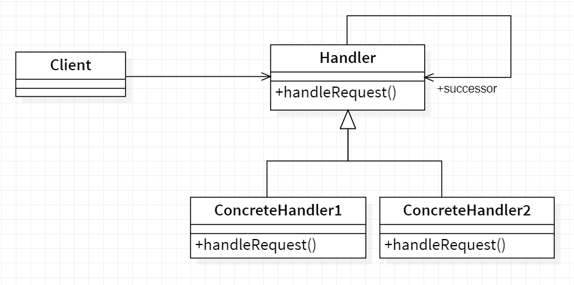
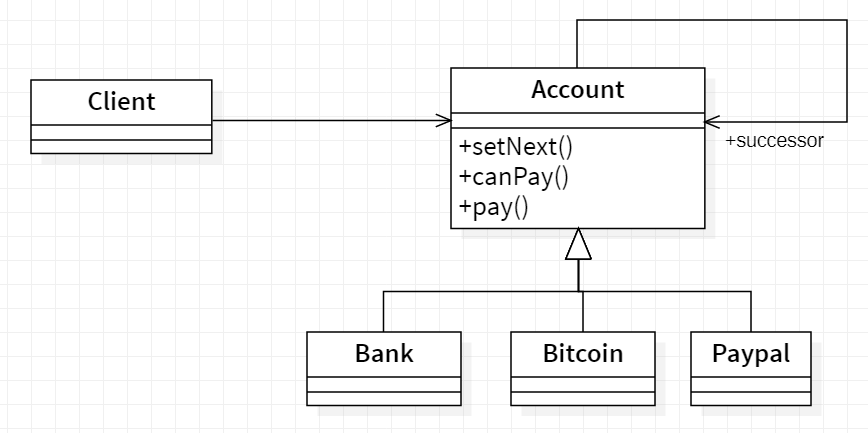

# 🔗 Chain of Responsibility

<b>Chain of responsibility</b> is a behavioral design pattern that lets you pass requests along a chain of handlers. Upon receiving a request, each handler decides either to process the request or to pass it to the next handler in the chain.

## Applicability

Use Chain of responsibility when :

- more than one object may handle a request, and the handler isn't known a
  priori. The handler should be ascertainedautomatically.
- you want to issue a request to one ofseveral objectswithout specifyingthe
  receiver explicitly.
- the set of objects that can handle a request should be specified dynamically.

## General structure

<p align="center">
  
</p>

- Handler :
  - defines an interface for handling requests.
  - (optional) implements the successor link.
- Concrete Handler :
  - handles requests it is responsible for.
  - can access its successor.
  - if the ConcreteHandler can handle the request, it does so; otherwise it
    forwards the request to its successor.
- Client : initiates the request to a ConreteHandler object on the chain.

## Example

For example, you have three payment methods (A, B and C) setup in your account; each having a different amount in it. A has 100 USD, B has 300 USD and C having 1000 USD and the preference for payments is chosen as A then B then C. You try to purchase something that is worth 210 USD. Using Chain of Responsibility, first of all account A will be checked if it can make the purchase, if yes purchase will be made and the chain will be broken. If not, request will move forward to account B checking for amount if yes chain will be broken otherwise the request will keep forwarding till it finds the suitable handler. Here A, B and C are links of the chain and the whole phenomenon is Chain of Responsibility.

<p align="center">
  
</p>

- Handler : Account.
- ConcreteHandlers : Bank, Paypal, Bitcoin.

The code source : [source folder](./src)

```Java
  public static void main(String []args) {

    //Create the instance of bulb
    Bulb bulb = new Bulb();

    //Creating Concrete commands
    TurnOn turnOn = new TurnOn(bulb);
    TurnOff turnOff = new TurnOff(bulb);

    //Create the invoker (Remote controller)
    RemoteController remote = new RemoteController();

    //Turn On the bulb
    System.out.println(remote.submit(turnOn));

    //Turn Off the buld
    System.out.println(remote.submit(turnOff));

  }

```

Output :

```
    Bulb has been lit
    Darkness!
```
