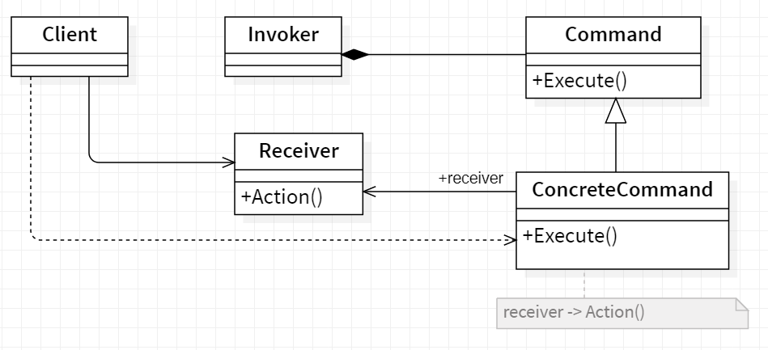
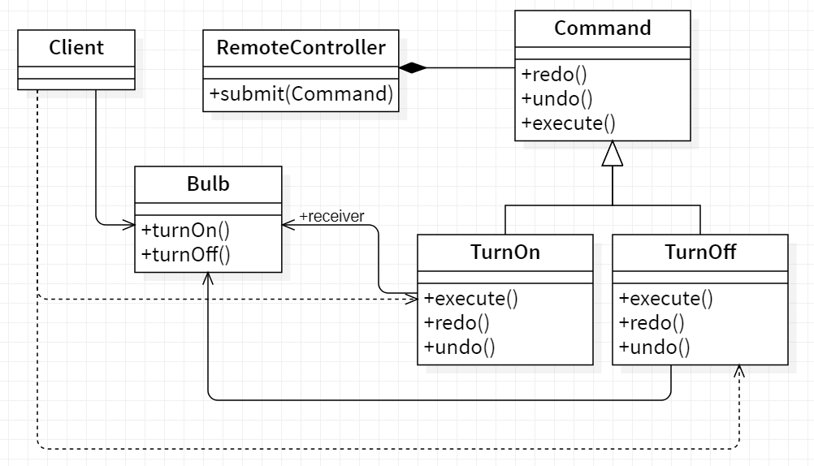

# 👮 Command

<b>Command</b> is a behavioral design pattern that turns a request into a stand-alone object that contains all information about the request. This transformation lets you pass requests as a method arguments, delay or queue a request’s execution, and support undoable operations.

## Applicability

Use the Command pattern when you want to :

- parameterize objects by an actiontoperform, asMenultem objects did above.
  You can express such parameterization in a procedural language with a
  callback function, that is, a function that's registered somewhere to be called
  at a later point. Commands are an object-oriented replacement for callbacks.
- specify, queue, and execute requests at different times. A Command object
  can have a lifetime independent of the original request. If the receiver of a
  request can be represented in an address space-independent way, then you
  can transfer a command object for the request to a different process and fulfill
  the request there.
- support undo. TheCommand's Execute operation can store state for reversing its effects in the command itself. The Command interface must have an
  added Unexecute operation that reverses the effects of a previous call to Execute. Executed commands are stored in a history list. Unlimited-level undo
  and redo is achieved by traversing this list backwards and forwards calling
  Unexecute and Execute,respectively.
- support logging changes so that they can be reapplied in case of a system
  crash. By augmenting the Command interface with load and store operations, you can keep a persistent log of changes. Recovering from a crash
  involves reloading logged commands from disk and reexecuting them with
  the Execute operation.
- structure a system around high-level operations built on primitives operations. Such a structure is common in informationsystems that support transactions. A transaction encapsulates a set of changes to data. The Command
  pattern offers a way to model transactions. Commands have a common interface, letting you invoke all transactions the same way. The pattern also
  makes it easy to extend the system with new transactions.

## General structure

<p align="center">
  
</p>

- Command : declares an interface for executing an operation.
- ConcreteCommand :
  - defines a binding between a Receiver object and an action.
  - implements Execute by invoking the corresponding operation(s) on Receiver.
- Client : creates a ConcreteCommand object and sets its receiver.
- Invoker : asks the command to carry out the request.
- Receiver : knows how to perform the operations associated with carrying out a request. Any class may serve as a Receiver.

## Example

A generic example would be you ordering food at a restaurant. You (i.e. Client) ask the waiter (i.e. Invoker) to bring some food (i.e. Command) and waiter simply forwards the request to Chef (i.e. Receiver) who has the knowledge of what and how to cook. Another example would be you (i.e. Client) switching on (i.e. Command) the television (i.e. Receiver) using a remote control (Invoker).

<p align="center">
  
</p>

- Command : Command
- ConcreteCommand : TurnOn and TurnOff
- Invoker : RemoteController
- Receiver : The Bulb

```Java
  public static void main(String []args) {

    //Create the instance of bulb
    Bulb bulb = new Bulb();

    //Creating Concrete commands
    TurnOn turnOn = new TurnOn(bulb);
    TurnOff turnOff = new TurnOff(bulb);

    //Create the invoker (Remote controller)
    RemoteController remote = new RemoteController();

    //Turn On the bulb
    System.out.println(remote.submit(turnOn));

    //Turn Off the buld
    System.out.println(remote.submit(turnOff));

  }

```

Output :

```
    Bulb has been lit
    Darkness!
```
