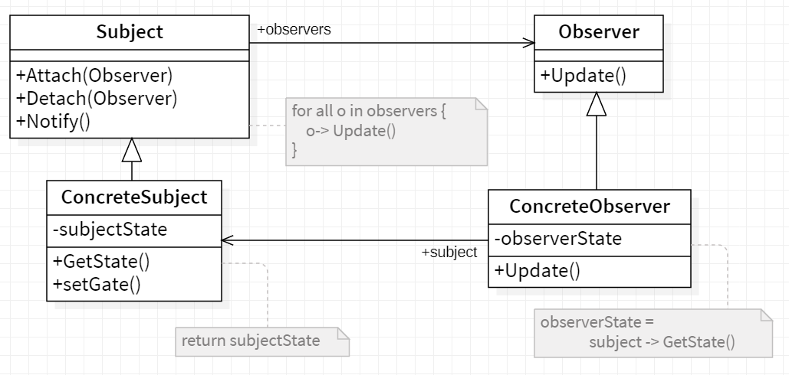

# 😎 Observer

<b>Observer</b> is a behavioral design pattern that lets you define a subscription mechanism to notify multiple objects about any events that happen to the object they’re observing.

## Applicability

Use the Observer pattern in any of the following situations:

- When an abstraction has two aspects, one dependent on the other. Encapsulating these aspects in separate objects lets you vary and reuse them independently.
- When a change to one object requires changing others, and you don't know
  how many objects need to be changed.
- When an object should be able to notify other objects without making assumptions about who these objects are. In other words, you don't want these
  objects tightly coupled.

## General structure

  

- Subject :
  - knows its observers. Any number of Observer objects may observe a subject.
  - provides an interface for attachingand detaching Observer objects.
- Observer :
  - defines an updating interface for objects that should be notified of changes in a subject.
- ConcreteSubject :
  - stores state ofinterest toConcreteObserver objects.
  - sends a notification to its observers when itsstate changes.
- ConcreteObserver ;
  - maintains a reference to a ConcreteSubject object.
  - stores state that should stay consistent with the subject's.
  - implements the Observer updating interface to keep its state consistent
    with the subject's.

## Example
