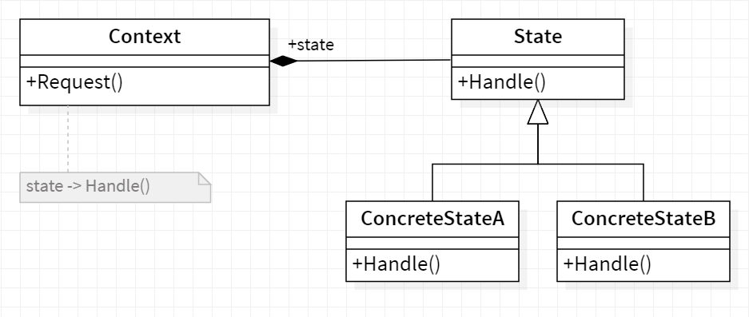

# 💢 State

<b>State</b> is a behavioral design pattern that lets an object alter its behavior when its internal state changes. It appears as if the object changed its class.

## Applicability

We use the State pattern in either of the following cases:

- An object's behavior depends on its state, and it must change its behavior at
  run-time depending on that state.
- Operations have large, multipart conditional statements that depend on the
  object's state. This state is usually represented by one or more enumerated
  constants. Often, several operations will contain this same conditional structure. The Statepattern puts each branch ofthe conditional in a separate class.This lets you treat the object's state as an object in its own right that can vary
  independently from other objects.

## General Structure

  

- Context stores a reference to one of the concrete state objects and delegates to it all state-specific work. The context communicates with the state object via the state interface. The context exposes a setter for passing it a new state object.
- The State interface declares the state-specific methods. These methods should make sense for all concrete states because you don’t want some of your states to have useless methods that will never be called.
- Concrete States provide their own implementations for the state-specific methods. To avoid duplication of similar code across multiple states, you may provide intermediate abstract classes that encapsulate some common behavior.
  State objects may store a backreference to the context object. Through this reference, the state can fetch any required info from the context object, as well as initiate state transitions.

## Example

Let's take an example of text editor, it lets you change the state of text that is typed i.e. if you have selected bold, it starts writing in bold, if italic then in italics etc.
