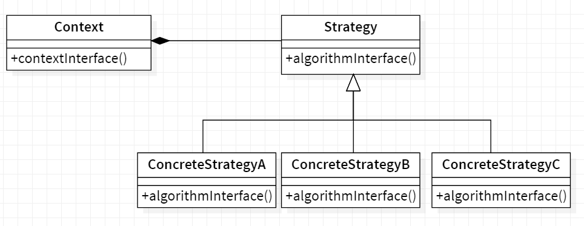
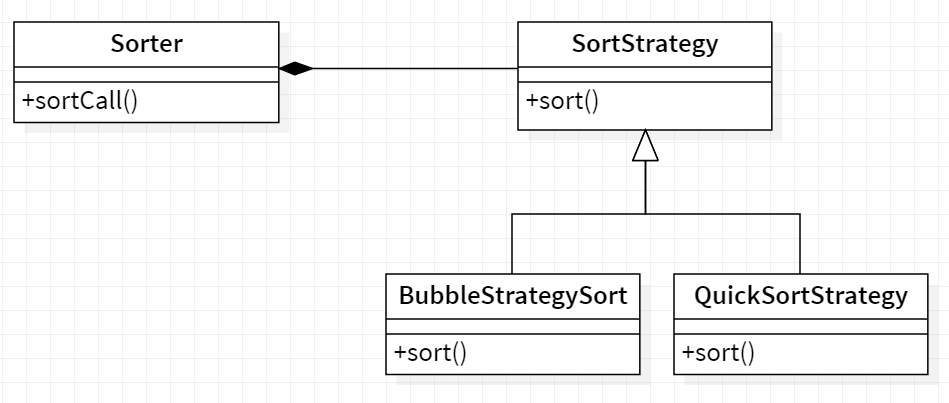

## 💡 Strategy

<b>Strategy</b> is a behavioral design pattern that lets you define a family of algorithms, put each of them into a separate class, and make their objects interchangeable.

## Applicability

Use the Strategy pattern when

- many related classes differ only in their behavior. Strategies provide a way
  to configure a class with one of many behaviors.
- you need different variants of an algorithm. For example, you might define algorithms reflecting different space/time trade-offs. Strategies can be
  used when these variants are implemented as a class hierarchy of algorithms.
- an algorithm uses data that clients shouldn't know about. Use the Strategy
  pattern to avoid exposing complex, algorithm-specific data structures.
- a class defines many behaviors, and these appear as multiple conditional
  statements in its operations. Instead of many conditionals, move related
  conditional branches into their own Strategy class.

## General structure

  

- Strategy : declares an interface common to all supported algorithms. Context uses this interface to call the algorithm defined by a ConcreteStrategy.
- ConcreteStrategy : implements the algorithm using the Strategy interface.
- Context : is configured with a ConcreteStrategy object.
  - maintains a reference to a Strategy object.
  - may define an interface that lets Strategy access its data.

## Example

Consider the example of sorting, we implemented bubble sort but the data started to grow and bubble sort started getting very slow. In order to tackle this we implemented Quick sort. But now although the quick sort algorithm was doing better for large datasets, it was very slow for smaller datasets. In order to handle this we implemented a strategy where for small datasets, bubble sort will be used and for larger, quick sort.

  

- Strategy : SortStrategy
- ConcreteStrategy : BubbleStrategySort & QuickSortStrategy
- Context : Sorter
