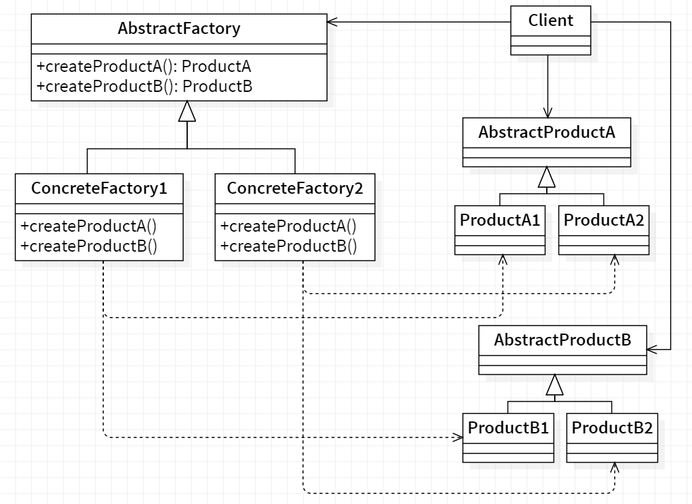

# 🔨 Abstract factory

<b>Abstract Factory</b> is a creational design pattern that lets you produce families of related objects without specifying their concrete classes.

## Applicability

We use the Abstract Factory pattern when :

- System should be independent of how its products are created, composed,
  and represented.
- System should be configured with one of multiple families of products.
- Family of related product objects is designed to be used together, and you
  need to enforce this constraint.
- We want to provide a class library of products, and you want to reveal just
  their interfaces, not their implementations.

## General Structure

  

## Example

Consider, you are building a house and you need doors. Based on your needs you might get a wooden door from a wooden door shop, iron door from an iron shop or a PVC door from the relevant shop. Plus you might need a guy with different kind of specialities to fit the door, for example a carpenter for wooden door, welder for iron door etc. As you can see there is a dependency between the doors now, wooden door needs carpenter, iron door needs a welder etc.
