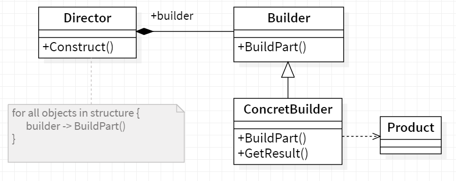

# 👷 Builder

<b>Builder</b> is a creational design pattern that lets you construct complex objects step by step. The pattern allows you to produce different types and representations of an object using the same construction code.

## Applicability

We use the Builder pattern when

- The algorithm for creating a complex object should be independent of the
  parts that make up the object and how they're assembled.
- The construction process must allow different representations for the object
  that's constructed.

## General Structure

  

- The Builder interface declares product construction steps that are common to all types of builders.
- Concrete Builders provide different implementations of the construction steps. Concrete builders may produce products that don’t follow the common interface.
- Products are resulting objects. Products constructed by different builders don’t have to belong to the same class hierarchy or interface.
- The Director class defines the order in which to call construction steps, so you can create and reuse specific configurations of products.

## Example

Imagine you are at Hardee's and you order a specific deal, lets say, "Big Hardee" and they hand it over to you without any questions; this is the example of simple factory. But there are cases when the creation logic might involve more steps. For example you want a customized Subway deal, you have several options in how your burger is made e.g what bread do you want? what types of sauces would you like? What cheese would you want? etc. In such cases builder pattern comes to the rescue.
