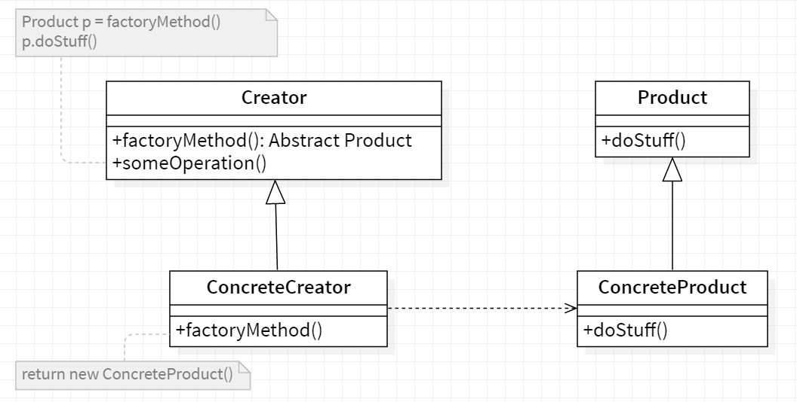

# Factory Method

<b>Factory Method</b> is a creational design pattern that provides an interface for creating objects in a superclass, but allows subclasses to alter the type of objects that will be created.

## General Structure

  

- The creator class can contain all the methods used to
  handle the products but the "factoryMethod()" method remains abstract.

- The concrete creator classes implement the "factoryMethod()" method which
  instantiates and returns the concrete products. Every concrete creator can
  therefore create products for which he is responsible.

- Finally all the products implement the same interface so that the
  classes using the products (such as the creator) can refer to them without
  know the concrete types.
