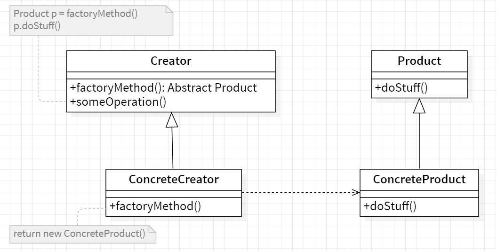
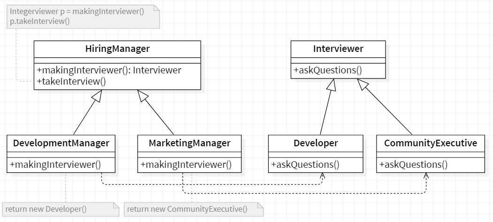

# 🏭 Factory Method

<b>Factory Method</b> is a creational design pattern that provides an interface for creating objects in a superclass, but allows subclasses to alter the type of objects that will be created.

## Applicability

we use the Factory Method pattern when :

- Class can't anticipate the class of objects it must create.
- Class wants it's subclass to specify the objects it creates.
- Classes deleguate responsability to one of several helper subclasses, and we want to localize the knowledge of which helper subclass is the delegate.

## General Structure

<p align="center">
  
</p>

- The creator class can contain all the methods used to
  handle the products but the "factoryMethod()" method remains abstract.

- The concrete creator classes implement the "factoryMethod()" method which
  instantiates and returns the concrete products. Every concrete creator can
  therefore create products for which he is responsible.

- Finally all the products implement the same interface so that the
  classes using the products (such as the creator) can refer to them without
  know the concrete types.

## Example

Consider the case of a hiring manager. It is impossible for one person to interview for each of the positions. Based on the job opening, she has to decide and delegate the interview steps to different people.

<p align="center">
  
</p>

First of all we have an `Interviewer` interface and some implementations for it,then we created abstract class `HiringManager` , Now any child can extend it and provide the required interviewer `DevelopementManager` and `MarketingManager`.
And then it can be used as :

The code source : [source folder](./src)

```Java
  public static void main(String []args){

    DevelopmentManager developmentManager = new DevelopmentManager();
    MarketingManager marketingManager = new MarketingManager();

    developmentManager.takeInterview();
    marketingManager.takeInterview();

  }

```

Output :

```
    Asking about design patterns!
    Asking about community building!
```
