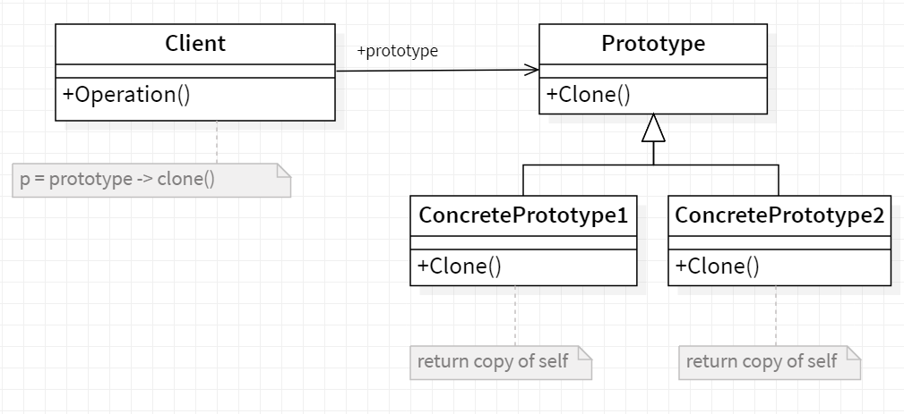
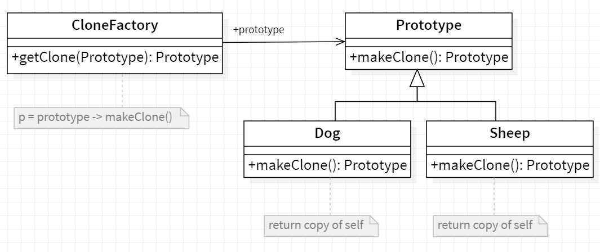

# 🐑 Prototype

<b>Prototype</b> is a creational design pattern that lets you copy existing objects without making your code dependent on their classes.

## Applicability

Use the Prototype pattern when a system should be independent of how its
products are created, composed, and represented; and

- When the classes to instantiate are specified at run-time, for example, by
  dynamic loading.
- To avoid building a class hierarchy offactories that parallels the class hierarchy of products.
- When instances of a class can have one of only a few different combinations
  of state. It may be more convenient to install a corresponding number of
  prototypes and clone them rather than instantiating the class manually, each
  time with the appropriate state.

## General Structure

<p align="center">
  
</p>

- Prototype : declares an interface for cloning itself.
- ConcretePrototype : implements an operation for cloning itself.
- Client : creates a new object by asking a prototype to clone itself.

## Example

Remember Dolly? The sheep that was cloned! Lets not get into the details but the key point here is that it is all about cloning.

In plain words : Create an object based on an existing object through cloning.

<p align="center">
  
</p>

In Java, the prototype pattern is recommended to be implemented as follows. First, create an interface with a method for cloning objects. In this example, Prototype interface accomplishes this with its copy method.

The code source : [source folder](./src)

```Java
  public static void main(String []args){

    CloneFactory animalMaker = new CloneFactory();

    //Create object type sheep and dog
    Sheep sally = new Sheep();
    Dog max = new Dog();

    //Clone sheep and dog instance
    Sheep clonedSheep = (Sheep) animalMake.getClone(sally);
    Dog clonedDog = (Dog) animalMake.getClone(max);

    System.out.println("Sally hashCode:- "+ sally.hashCode());
    System.out.println("SallyClone hashCode:- "+ clonedSheep.hashCode());

    System.out.println("\nMax hashCode:- "+ max.hashCode());
    System.out.println("MaxClone hashCode:- "+ clonedDog.hashCode());

  }

```

Output :

```
    Sally hashCode:- 1435741095
    SallyClone hashCode:- 1981243562

    Max hashCode:- 1550089733
    MaxClone hashCode:- 1346782756

```
