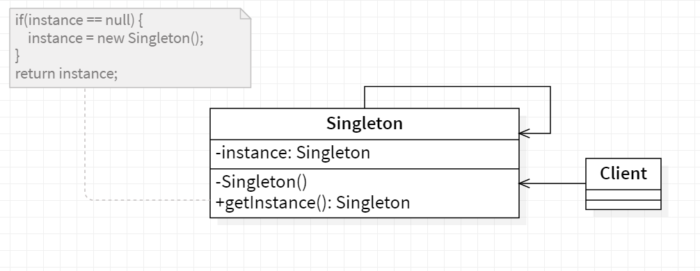
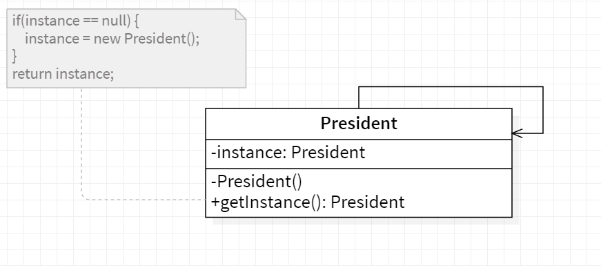

# ❄️ Singleton

<b>Singleton</b> is a creational design pattern that lets you ensure that a class has only one instance, while providing a global access point to this instance.

## Applicability

Use the Singleton pattern when

- There must be exactly one instance of a class, and it must be accessible to
  clients from a well-known access point.
- When the sole instance should be extensible by subclassing, and clients
  should be able to use an extended instance without modifying their code.

## General Structure

<p align="center">
  
</p>

The Singleton class declares the static method getInstance that returns the same instance of its own class.

The Singleton’s constructor should be hidden from the client code. Calling the getInstance method should be the only way of getting the Singleton object.

## Example

There can only be one president of a country at a time. The same president has to be brought to action, whenever duty calls. President here is singleton.

<p align="center">
  
</p>

Note : To create a singleton,we have to make the constructor private, disable cloning, disable extension and create a static variable to house the instance.

The code source : [source folder](./src)

```Java
  public static void main(String []args){

    President presidentOne = President.getInstance();
    President presidentTwo = President.getInstance();

    System.out.println("PresidentOne hashCode:- "+ presidentOne.hashCode());
    System.out.println("PresidentTwo hashCode:- "+ PresidentTwo.hashCode());

  }

```

Output :

```
    PresidentOne hashCode:- 1550089733
    PresidentTwo hashCode:- 1550089733
```
