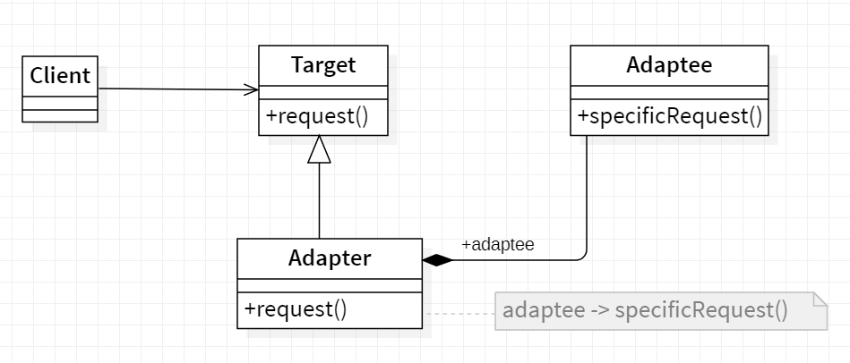
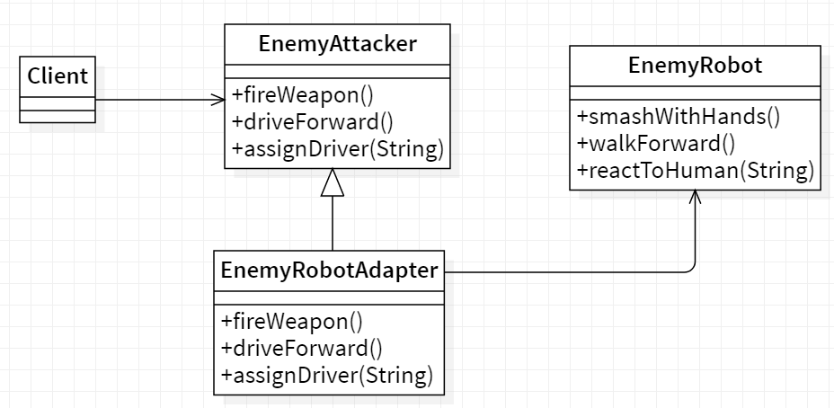

# 🔌 Adapter

<b>Adapter</b> is a structural design pattern that allows objects with incompatible interfaces to collaborate.

## Applicability

Use the Adapter pattern when

- you want to use an existing class, and its interface does not match the one
  you need.
- you want to create a reusable class that cooperates with unrelated orunforeseen classes, that is, classes that don't necessarily have compatible interfaces.
- (object adapter only) you need to use several existing subclasses, but it's unpractical to adapt their interface by subclassing every one. An object adapter
  can adapt the interface of its parent class.

## General structure

<b>Object Adapter</b> :
This implementation uses the object composition principle: the adapter implements the interface of one object and wraps the other one. It can be implemented in all popular programming languages.

<p align="center">
  
</p>

- Target : defines the domain-specific interface that Client uses.
- Client : collaborateswith objects conforming to the Target interface.
- Adaptee : defines an existing interface that needs adapting.
- Adapter :adapts the interface of Adaptee to the Target interface

## Example

Consider that we have a video game where we have a `EnemyAttacker` that can fire a weapon , drive forward and assign driver however we want to create an AI `EnemyRobot`, now a enemy robot has no need for a driver also it's not going to drive forward it's going to walk. In this situation we will need to implement an adapter `EnemyRobotAdapter` to adapt the enemyRobot with enemyAttacker.

<p align="center">
  
</p>

The code source : [source folder](./src)

```Java
  public static void main(String []args){

    //The adaptee
    EnemyRobot fredTheRobot = new EnemyRobot();
    //The adapter
    EnemyAttacker robotAdapter = new EnemyRobotAdapter(fredTheRobot);

    System.out.println("The robot --------------------------------");
    fredTheRobot.reactToHuman("paul");
    fredTheRobot.walksForward();
    fredTheRobot.smashWithHands();


    System.out.println("\nThe robot with Adapter -------------------");
    robotAdapter.assignDriver("paul");
    robotAdapter.driveForward();
    robotAdapter.fireWeapon();

  }

```

Output :

```
    The robot --------------------------------
    Enemy robot causes 7 Damage with its hands
    Enemy robot walks forward 3 spaces
    Enemy robot Tramps on paul

    The robot with adapter -------------------
    Enemy robot causes 5 Damage with its hands
    Enemy robot walks forward 4 spaces
    Enemy robot Tramps on paul
```
