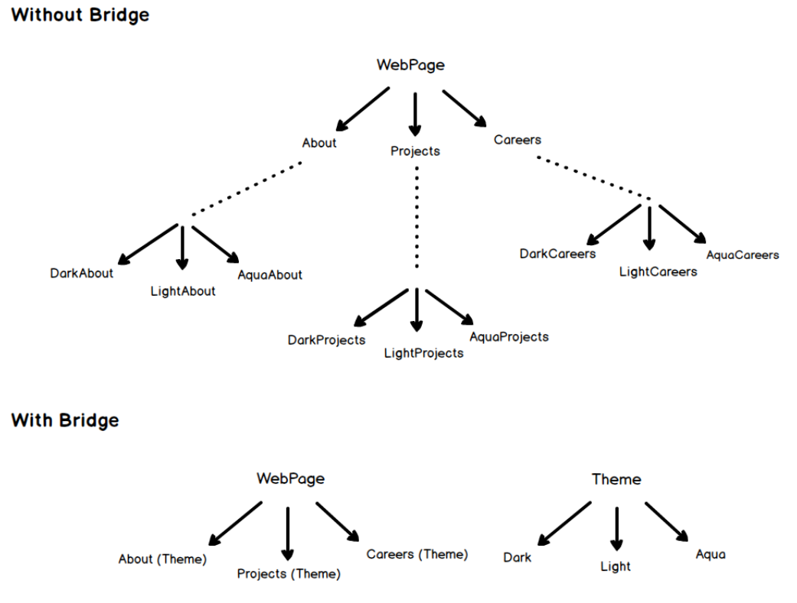

# 🌉 Bridge

<b>Bridge</b>is a structural design pattern that lets you split a large class or a set of closely related classes into two separate hierarchies—abstraction and implementation—which can be developed independently of each other.

## Applicability

Use the Bridge pattern when

- you want to avoid a permanent binding between an abstraction and its implementation. This might be the case,for example,when the implementation
  must be selected or switched at run-time.
- both the abstractions and their implementations should be extensible by
  subclassing. In this case, the Bridge pattern lets you combine the different
  abstractions and implementations and extend them independently.
- changes in the implementation of an abstraction should have no impact on
  clients; that is, their code should not have to be recompiled.

## General Structure

<p align="center">
  
</p>

- Abstraction :
  - defines the abstraction's interface.
  - maintains a reference to an object of type Implementor.
- RefmedAbstraction : Extendsthe interface defined byAbstraction.
- Implementor : defines the interface for implementation classes. This interface doesn't
  have to correspond exactly to Abstraction's interface;in fact the two interfaces can be quite different. Typically the Implementor interface provides
  only primitive operations, and Abstraction defines higher-level operations
  based on these primitives.
- Concretelmplementor : implements the Implementor interface and defines its concrete implementation.

## Example

Consider you have a website with different pages and you are supposed to allow the user to change the theme. What would you do? Create multiple copies of each of the pages for each of the themes or would you just create separate theme and load them based on the user's preferences? Bridge pattern allows you to do the second i.e.

<p align="center">
  
</p>

The code source : [source folder](./src)

```Java
  public static void main(String []args){

    LightTheme lightTheme = new LightTheme();
    DarkTheme darkTheme = new DarkTheme();

    WebPage about = new About(lightTheme);
    WebPage careers = new Careers(DarkTheme);

    about.getContent();
    careers.getContent();

  }

```

Output :

```
    About page in Light mode
    Careers page in Dark mode
```
