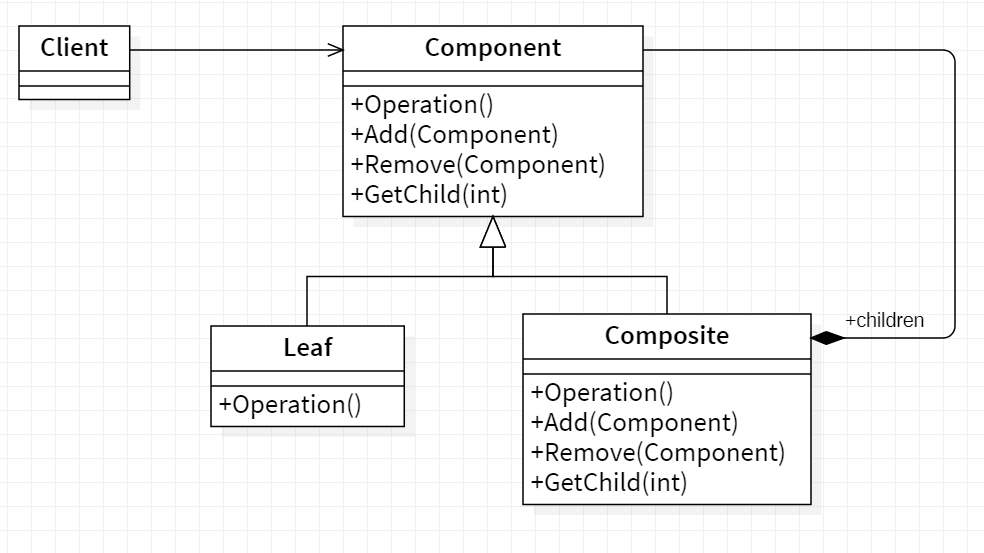

## 🌿 Composite

<b>Composite</b> is a structural design pattern that lets you compose objects into tree structures and then work with these structures as if they were individual objects.

## Applicablity

Use the Composite pattern when

- you want to represent part-whole hierarchies ofobjects.
- you want clients to be able to ignore the difference between compositionsof
  objects and individual objects.Clients will treat all objectsin the composite
  structure uniformly.

## General structure

  

- Component :
  - declares the interface for objectsin the composition.
  - implements default behavior for the interface common to all classes, as
    appropriate.
  - declares an interface for accessing and managing its child components.
  - (optional) defines an interface for accessing a component's parent in the
    recursive structure, and implements it if that's appropriate.
- Leaf :
  - represents leaf objects in the composition. A leaf has no children.
  - defines behavior for primitive objects in the composition.
- Composite :
  - defines behavior for components having children.
  - stores child components.
  - implements child-related operations in the Component interface.
- Client :
  - manipulates objects in the composition through the Component interface.

## Example
