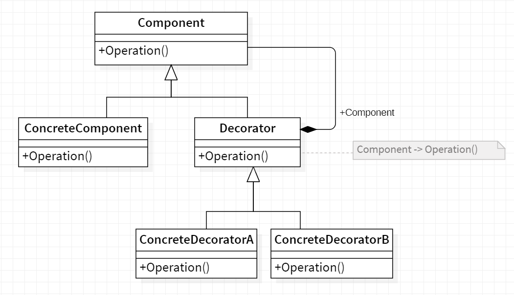

# ☕ Decorator

<b>Decorator</b> is a structural design pattern that lets you attach new behaviors to objects by placing these objects inside special wrapper objects that contain the behaviors.

## Applicability

Use Decorator

- to add responsibilities to individual objects dynamically and transparently,
  that is, without affecting other objects.
- forresponsibilities that canbe withdrawn.
- when extension by subclassing is impractical. Sometimes a large number
  of independent extensions are possible and would produce an explosion of
  subclasses to support every combination. Or a class definition maybe hidden
  or otherwise unavailable for subclassing.

## General Structure

  

- Component : defines the interface for objects that can have responsibilities added to them dynamically.
- ConcreteComponent : defines an object towhich additional responsibilities canbe attached.
- Decorator : maintains a reference to a Component object and defines an interface that conforms to Component's interface.
- ConcreteDecorator : adds responsibilities to the component.

## Example

Lets take coffee for example. First of all we have a simple coffee implementing the coffee interface , We want to make the code extensible to allow options to modify it if required. Lets make some add-ons (decorators)
