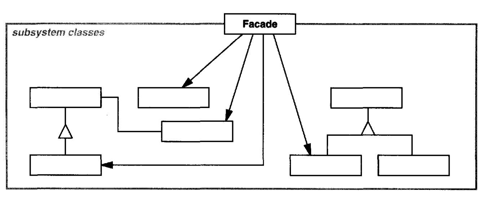

# 📦 Facade

<b>Facade</b> is a structural design pattern that provides a simplified interface to a library, a framework, or any other complex set of classes.

## Applicability

Use the Facadepattern when

- you want to provide a simple interface to a complexsubsystem. Subsystems
  often get more complex as they evolve. Most patterns, when applied, result
  in more and smaller classes. This makes the subsystem more reusable and
  easier to customize, but it also becomes harder to use for clients that don't
  need to customize it. A facade can provide a simple default view of the
  subsystem that is good enough for most clients. Only clients needing more
  customizability will need to look beyond the facade.
- there aremany dependencies between clients and theimplementation classes
  of an abstraction.Introduce a facade to decouple the subsystem from clients
  and other subsystems, thereby promoting subsystem independence and
  portability.
- you want to layer your subsystems. Use a facade to define an entry point to
  each subsystem level. If subsystems are dependent, then you can simplify
  the dependencies between them by making them communicate with each
  other solely through their facades.

## General structure

  

- Facade :
  - knows which subsystem classes are responsible for a request.
  - delegates client requests to appropriate subsystem objects.
- subsystem classes :
  - implement subsystem functionality.
  - handle work assigned by the Facade object.
  - have no knowledge of the facade; that is, they keep no references to it.

## Example

How do you turn on the computer? "Hit the power button" you say! That is what you believe because you are using a simple interface that computer provides on the outside, internally it has to do a lot of stuff to make it happen. This simple interface to the complex subsystem is a facade.
