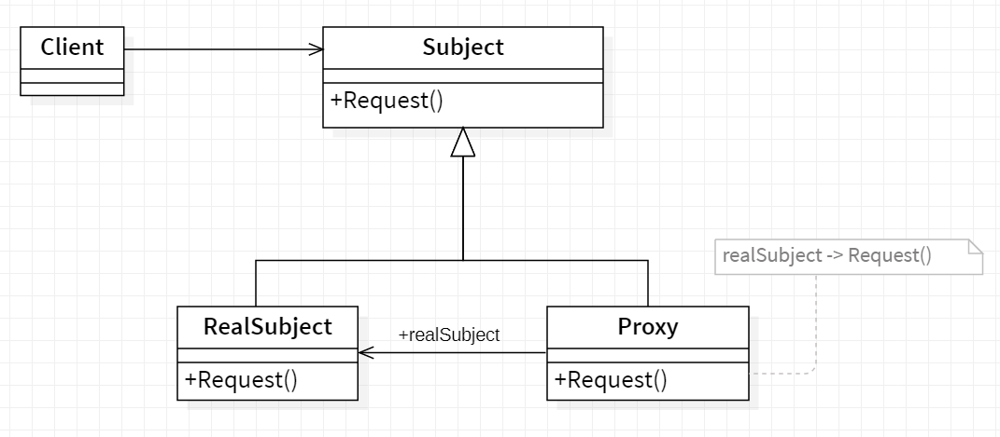

## 🎱 Proxy

<b>Proxy</b> is a structural design pattern that lets you provide a substitute or placeholder for another object. A proxy controls access to the original object, allowing you to perform something either before or after the request gets through to the original object.

## Applicability

Proxy is applicable whenever there is a need for a more versatile or sophisticated
reference to an object than a simple pointer.Here are several common situations
in which the Proxy pattern is applicable:

- Remote proxy provides a local representive for an in a different address space.
- Virtual proxy creates expensive objects on demand.
- Protection proxy controls access to the original object.

## General structure

  

- Proxy :
  - maintains a reference that lets the proxy access the real subject. Proxy may
    refer to a Subject if the RealSubject and Subjectinterfaces are the same.
  - provides an interface identical to Subject's so that a proxy can by substituted for the real subject.
  - controls access to the real subject and may be responsible for creating and
    deleting it.
- Subject :
  - defines the common interface for RealSubject and Proxy so that a Proxy
    can be used anywhere a RealSubject is expected.
- RealSubject :
  - defines the real object that the proxy represents.

## Example
